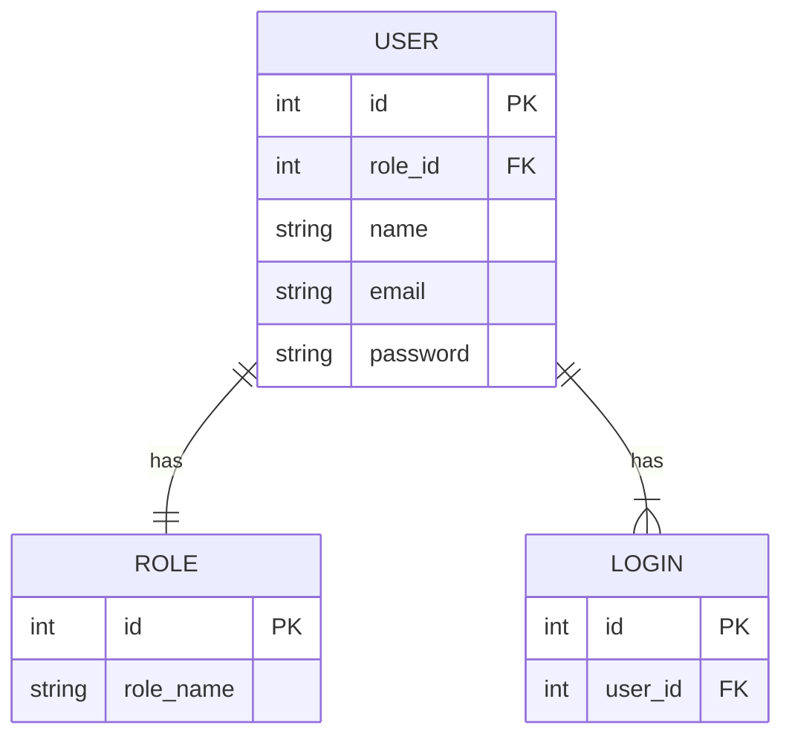

```mermaid
erDiagram
    USER{
        int id PK
        int role_id FK
        string name
        string email
        string password
    }

    LOGIN{
        int id PK
        int user_id FK
    }

    ROLE{
        int id PK
        string role_name
    }
    
    USER ||--|| ROLE : has
    USER ||--|{ LOGIN : has
```